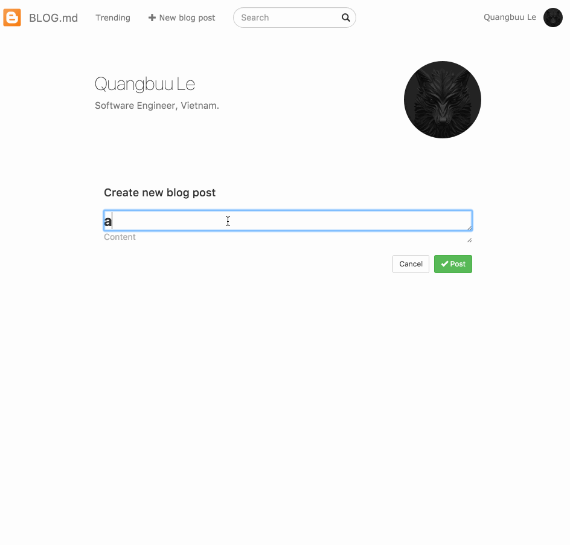

#BLOG.md
Demo page: [http://103.47.192.73:3000/posts](http://103.47.192.73:3000/posts)

##Run
It requires webpack to run. So we have to have that node process first.
```
npm install
node devServer.js
```

Start the server.
```
rails s
```

##Walkthrough

